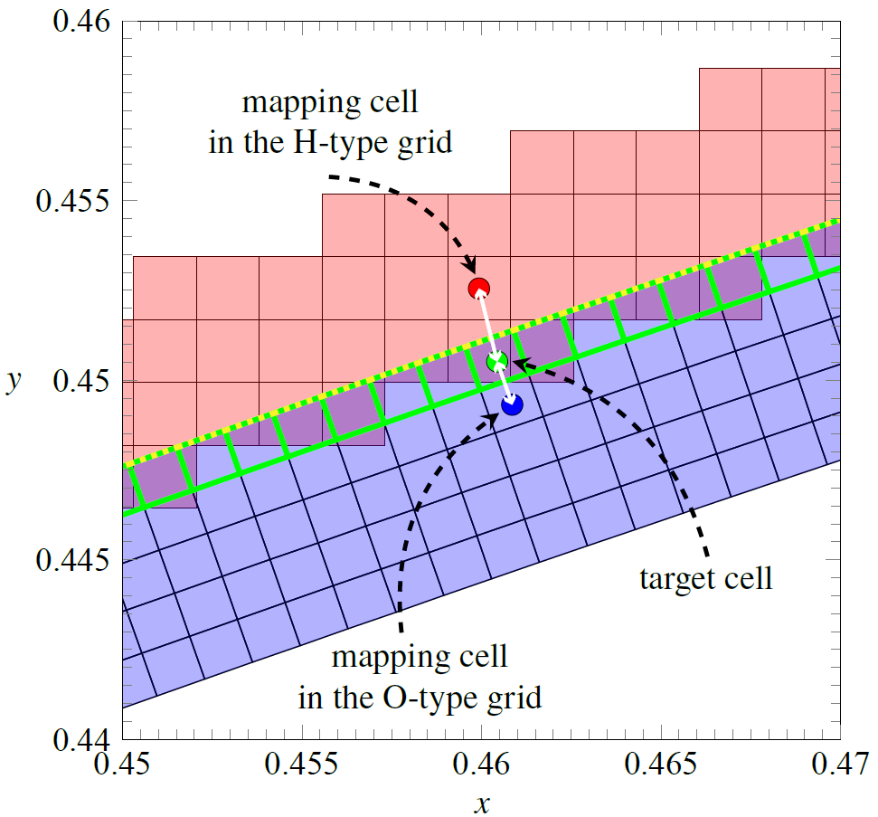
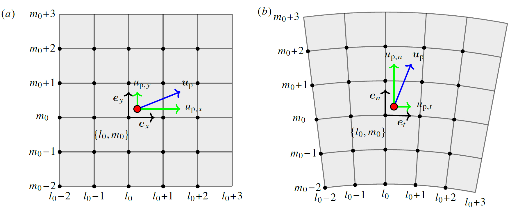

# Particle

A particle tracking module designed for multi-block overset grids [1] is presented here. By integrating the current particle module with an appropriate fluid solver, we can perform direct numerical simulations of particle-laden flows with complex geometries such as turbomachinery flows, and an example of the numerical configuration is shown in the figure below.

# Information
The present module for particle tracking is developed by Mr. Taiyang Wang, who is funded and advised by Prof. Yaomin Zhao from Peking University.

Programming language: Fortran

External library: MPI

# Features

The main features of this module are summarized:

1. Based on the particle location, each particle that is located in the valid domain is assigned to either the background H-type grid or the O-type grid. For particles located in overlapping regions, they are stored in the O-type grid. This procedure is conducted before the simulation by the subroutine ***read_particles_data_init***, and the implementation details are shown in the figure below.
   

   
   In this process, owing to the curved geometry of the O-type grid, both the ray-casting [2] and angle summation algorithms [3] are utilized, corresponding to the functions ***particle_in_polygon*** and ***particle_in_convex_quadrilateral***, respectively.
2. Neglecting particle rotation and temperature, each point particle is modeled as a spherical rigid body. Moreover, particle-wall interactions are described by the hard-sphere model, which is achieved by the subroutine ***bounce_particles***.
   

3. Affected by the drag force calculated in the subroutine ***compute_particles_force***, both the particle location and velocity need to be updated at each time step. In the present study, the second-order Velocity-Verlet algorithm is used, which is implemented by the subroutine ***timeadvance_redistribute_particles***. Besides, a trilinear scheme is applied for interpolation, where the weights are obtained by the function ***interpolation_weights***.

4. Utilizing the MPI parallelization strategy, particles in each block are handled separately on each processor unless they pass through the interface between blocks, namely the outer boundary of the O-type grid. Consequently, different situations may occur, which should be handled carefully. This tricky problem is solved in the subroutine ***timeadvance_redistribute_particles***, and the details are shown by the flow chart below.
   

5. Redistributing a particle to the correct processor and grid cell incurs a high computational cost; therefore, two optimization strategies are implemented to enhance performance. One is inter-block mapping within overlapping zones, which is initialized in the subroutine ***set_mapping_indexes***. Based on this mapping, the particle in a cell will first be redistributed to the corresponding cell.
   

   
   The other is a search-locate algorithm based on particle velocity. If the particle is located in the H-type block, then the velocity is decomposed in the global Cartesian coordinates. In comparison, if the particle is located in the O-type block, then the velocity is decomposed in the local orthogonal coordinate system (the tangent and normal directions). Starting from the current grid cell, the search scope is expanded from inner to outer layers, and the local strategy is implemented in subroutines ***update_B_grid_ij_particle*** and ***update_O_grid_ij_particle_prediction***.
   

6.	Throughout the simulation, particles are continuously added from the inlet at fixed locations by the subroutine ***add_particles***, and their velocities are interpolated from the fluid domain. Here, the information about the added particles is obtained before the simulation by the subroutine ***read_added_particles_init***, where the file 'ADDED_PARTICLES_INPUT.dat' is necessary. Additionally, particles that exit the domain are removed from the simulation.

# References

[1] M. Deuse, R. D. Sandberg, Implementation of a stable high-order overset grid method for high-fidelity simulations, Comp. Fluids 211 (2020) 104449.

[2] M. Shimrat, Algorithm 112: Position of point relative to polygon, Commun. ACM 5 (8) (1962) 434.

[3] K. Hormann, A. Agathos, The point in polygon problem for arbitrary Computational Geometry 20 (3) (2001) 131-144.

# Acknowledgements

The authors wish to thank:

• Prof. Richard D. Sandberg from the University of Melbourne, and his fluid solver HiPSTAR.

• Research Associate Baoqing Meng from the Chinese Academic of Sciences and Prof. Baolin Tian from Beihang University, and their helpful suggestions.

• Mr. Zi-Mo Liao from the University of Science and Technology of China, and his helpful instructions.

